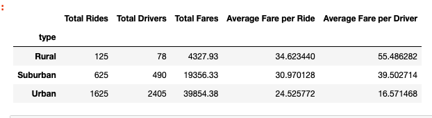
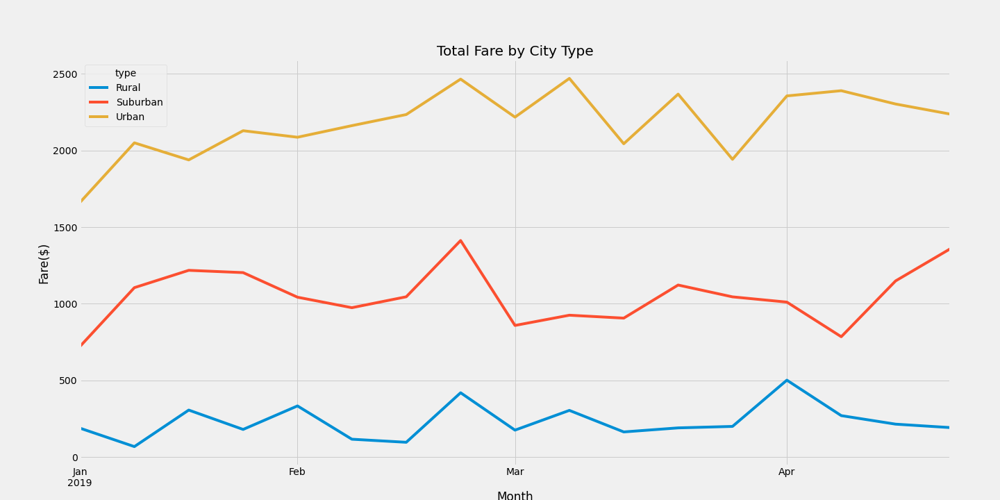

# PyBer_Analysis
## Purpose of New Analysis
  The purpose of this analysis is to create a summary DataFrame of the ride-sharing data by city type. Using Pandas and Matplotlib to create graph to show the total weekly fares for each city type(Urban, Suburban and Rural). 
  
## Results

The urban city type had the most rides at 1625 when compared to the other city type, with suburban city type with 1000 less at 625. The rural city type has the least amound of rounds at 125. The same city ranking applies when comparing total drivers. Urban cities had a total of 2405 drivers and suburban drivers at 490. rural cities had the last amount at 78. Urban cities had the most when comparing total fares. Suburban cities came in second. Although urban cities had the most rides, it had the lowest average fare per ride and the lowest average fare per driver. 

## Summary 

All three city type had the same peak at the end of February and early March. The suburban type showed an uptick towards the end of April. 
